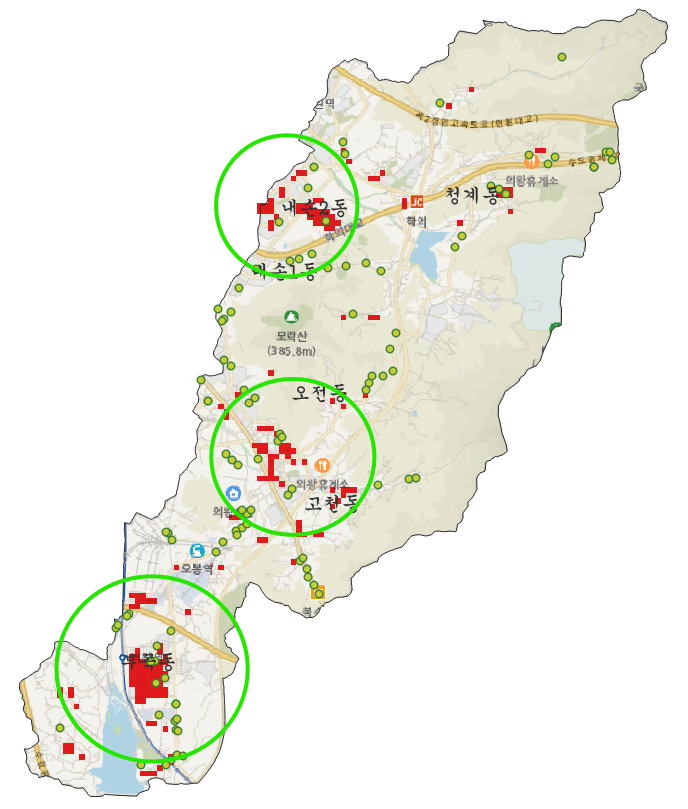
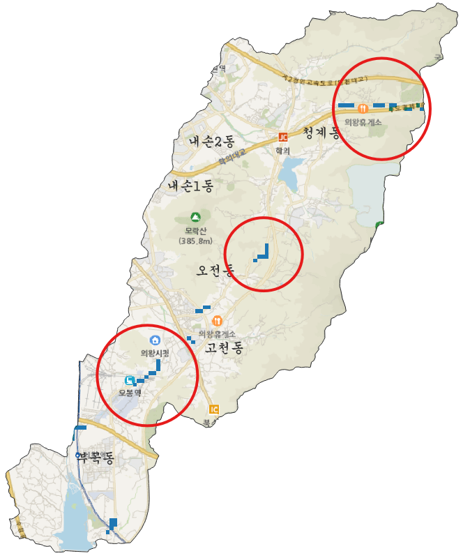
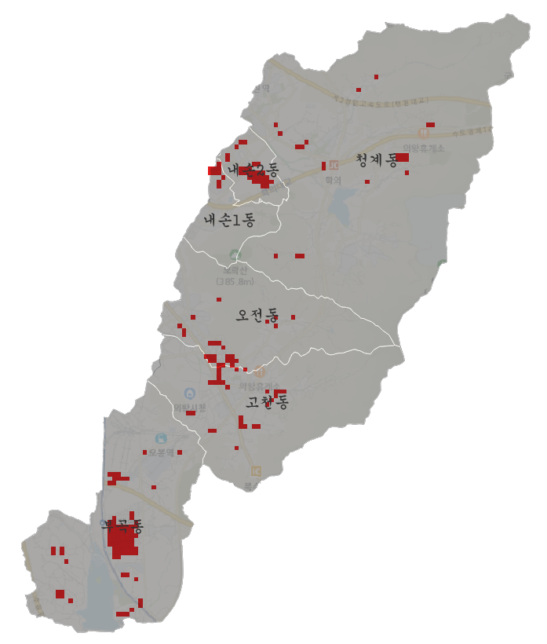
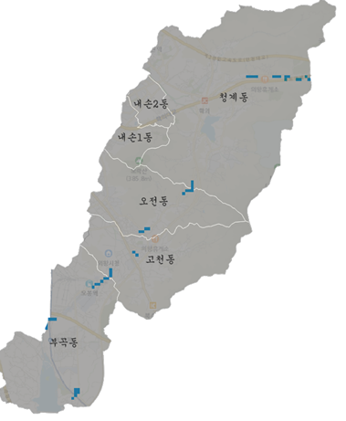

# 의왕시 제설 우선지역 분석

의왕시의 겨울철 제설 우선 대상 지역을 찾기 위해 기상 데이터, 도로 데이터, 고령인구, 노후건물, 행정경계, DEM(수치표고모델) 데이터를 결합해 분석한 프로젝트입니다. Python으로 기상 데이터를 시각화하고, 공간 분석 결과는 QGIS 기반으로 제작했습니다.

## 프로젝트 개요

- 목적: 제설 취약지역과 제설함 추가 설치 우선 지역 도출
- 대상 지역: 경기도 의왕시
- 주요 도구: Python, QGIS
- 주요 산출물: 기상 그래프, 취약요인 시각화, 제설 우선지역 지도

## 분석 결과

  
  

  
  

## 데이터 구성

### 기상 데이터 
- 2021.1.1 ~ 2026.1.1 5개년치 기상 데이터 (기상청 종관기상관측)
- 활용: 최저기온 그래프, 월별 평균 지면 온도 그래프

### 취약지역 분석 데이터  
- 고령인구 (국토지리정보원:국토정보플랫폼)  
- 노후건물 (국토지리정보원:국토정보플랫폼)  
- 도로 및 결빙 (국가교통정보센터)  
- 표준노드링크 (국가교통정보센터)  

### 제언 데이터
- 의왕시 제설함 배치현황 (공공 데이터포털)  

### 기타 공간 데이터
- 의왕시 행정경계 데이터 (공간데이터 마켓)  
- DEM 데이터 (국토지리정보원:국토정보플랫폼)  